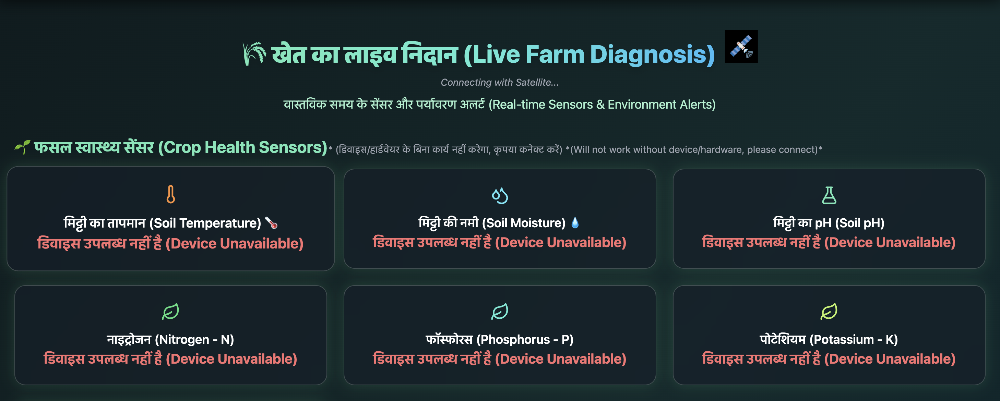
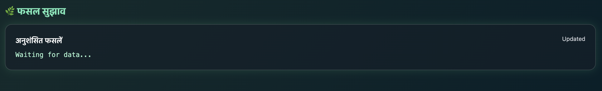
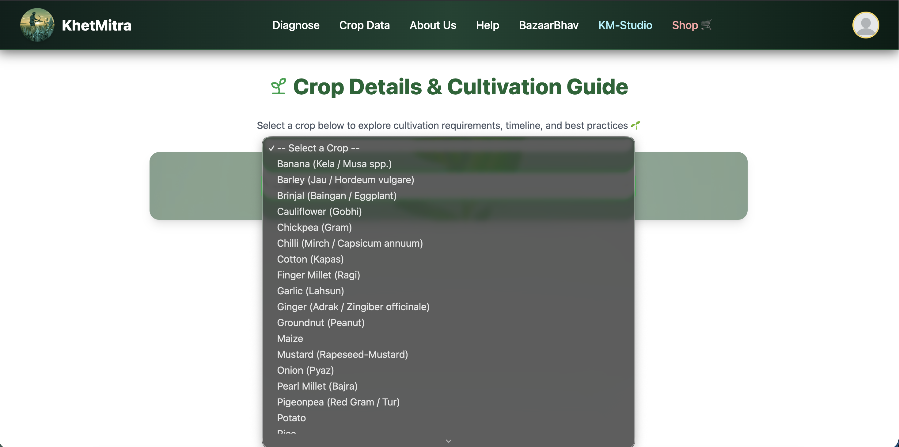
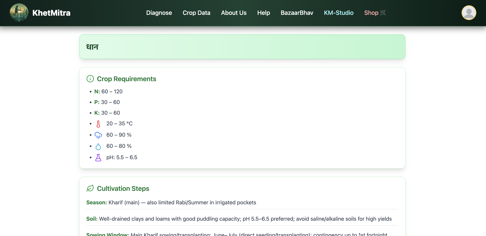
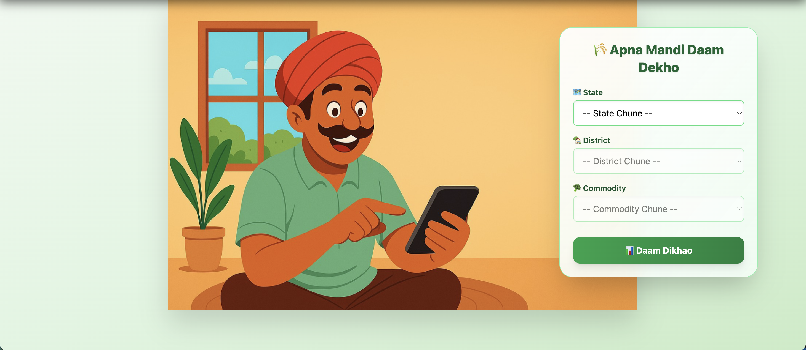
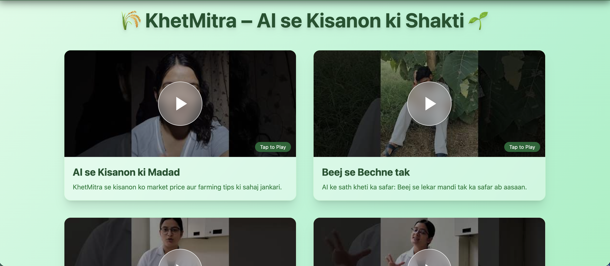
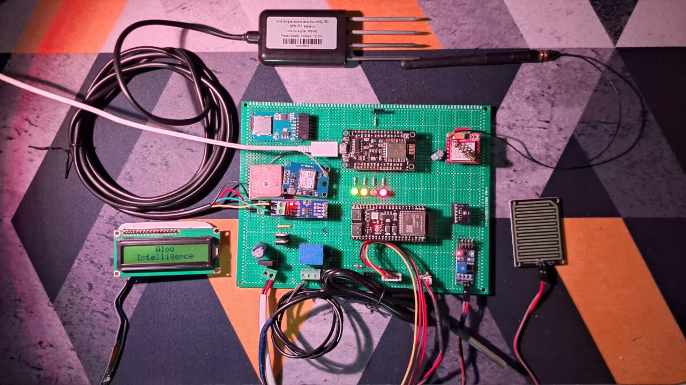
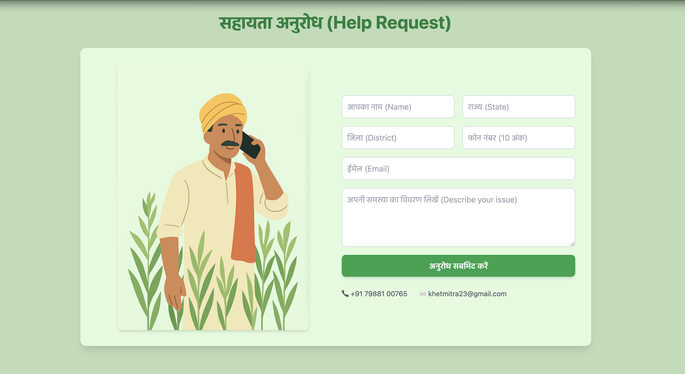

<table align="center">
  <tr>
    <td>
      
    </td>
    <td style="padding-left:12px;font-size:42px;font-weight:700;vertical-align:middle;">
      🌾 KhetMitra
    </td>
  </tr>
</table>

  

<b>Hackathon:</b> Hack The Winter – The Second Wave (Angry Bird Edition) 
<b>Organised by:</b> Graphic Era Hill University (GEHU), Bhimtal 
<b>Problem Statement:</b> Open Innovation 
<b>Team Name:</b> Aloo Intelligence (AI) 🥔🧠

  📄 <b>Hackathon Presentation</b> 
  <a href="assets/hack_the_winter.pdf" target="_blank" style="font-size:16px;font-weight:600;">
    👉 Click here to view the project presentation
  </a>

<h2>👋 What is KhetMitra?</h2>

<table width="100%">
<tr>
<td width="55%" valign="top">

<b>KhetMitra</b> is a one-stop solution for farmers.  
Instead of using multiple apps, guesswork, or costly services,  
KhetMitra helps farmers <b>understand their soil</b>, choose the right crop,  
and make better decisions using simple technology.

  

We are building this keeping <b>real farmers and real fields</b> in mind —  
not just for a demo or presentation.

</td>

<td width="45%" align="center" valign="middle">

</td>
</tr>
</table>

---

<table width="100%">
<tr>
<td width="55%" valign="top">

<h2>🚜 Why We Built This</h2>

Most farmers face these problems:

<ul>
  <li>No proper soil testing before sowing</li>
  <li>Crop selection based on guess or tradition</li>
  <li>No clarity on market prices</li>
  <li>Expensive devices that don’t last long</li>
  <li>Apps that are hard to use</li>
</ul>

</td>

<td width="45%" align="center" valign="middle">

</td>
</tr>
</table>

**KhetMitra** tries to solve **all of this at one place**.

---

<!-- WHAT KHETMITRA PROVIDES -->
<h2>🧩 What KhetMitra Provides</h2>

<table width="100%">
<tr>
<td width="65%" valign="top">

<h3>🔍 Diagnose</h3>

<ul>
  <li>Soil health check using our <b>IoT sensor kit</b></li>
  <li>Measures <b>NPK, soil moisture, temperature</b></li>
  <li>Uses <b>satellite & weather data</b></li>
  <li>Sensors are <b>rugged, reusable, long-life</b></li>
</ul>

🌾 <b>खेत का लाइव निदान (Live Farm Diagnosis)</b> 
Satellite – Connecting with Satellite... 
Real-time Sensors & Environment Alerts

</td>

<td width="35%" align="center" valign="middle">
   
  
</td>
</tr>
</table>

<!-- CROP HEALTH SENSORS -->
<table width="100%">
<tr>
<td width="60%" valign="top">

<h4>🌱 Crop Health Sensors</h4>
<i>(Will not work without device / hardware)</i>

<ul>
  <li>🌡️ Soil Temperature: 0</li>
  <li>💧 Soil Moisture: 0</li>
  <li>🧪 Soil pH: 0</li>
  <li>🟢 Nitrogen (N): 0</li>
  <li>🟡 Phosphorus (P): 0</li>
  <li>🔵 Potassium (K): 0</li>
</ul>

</td>

<td width="40%" align="center" valign="middle">

</td>
</tr>
</table>

 

<!-- ENVIRONMENT ALERTS -->
<table width="100%">
<tr>
<td width="60%" valign="top">

<h4>⚡ Environment Alerts</h4>
<i>(Will not work without device / hardware)</i>

<ul>
  <li>🌡️ Area Temperature: 0</li>
  <li>📏 Pressure: 0</li>
  <li>⛰️ Altitude: 0</li>
  <li>☔ Rain Alert: No</li>
  <li>💡 Light Intensity: 0</li>
  <li>⚡ Wind Alert: 0</li>
  <li>🐄 Grazing Alert: No</li>
</ul>

</td>

<td width="40%" align="center" valign="middle">

</td>
</tr>
</table>

---

<h3>🌱 Crop Recommendation</h3>

<ul>
  <li>Crop suggestion based on:</li>
  <ul>
    <li>Soil condition</li>
    <li>Location & season</li>
    <li>Weather and satellite data</li>
  </ul>
  <li><b>AI helps reduce risk of wrong crop selection</b></li>
</ul>

</td>

<td width="45%" align="center" valign="middle">

</td>
</tr>
</table>

---

<!-- ===================== CROP DATA ===================== -->
<table width="100%" cellpadding="0" cellspacing="0">
<tr>

<td width="55%" valign="top" style="padding-right:20px;">

<h3>📊 Crop Data</h3>

Plan cultivation confidently with <b>step-by-step crop intelligence</b>.

<ul>
  <li>📌 Detailed crop information</li>
  <li>💧 Water & fertilizer guidance</li>
  <li>📆 Season-wise best practices</li>
</ul>

<b>Crop Details & Cultivation Guide</b> 
Select a crop → View growth stages, irrigation plan & best practices 🌱

</td>

<td width="45%" align="center">

</td>
</tr>
</table>

---

<!-- ===================== BAZAARBHAV ===================== -->
<table width="100%" cellpadding="0" cellspacing="0">
<tr>
<td width="55%" valign="top" style="padding-right:20px;">
<h3>💰 BazaarBhav</h3>

<b>Live mandi prices</b> to decide the best selling time.

<ul>
<li>📍 Nearby mandi rates</li>
<li>📈 Compare prices</li>
<li>⏰ Sell at peak profit</li>
</ul>

🌾 <b>Apna Mandi Daam Dekho</b> 
Select <i>State → District → Commodity</i>  
to view live mandi prices 📊

</td>

<td width="45%" align="center">

Live mandi price dashboard

</td>
</tr>
</table>

---

<!-- ===================== KM-STUDIO ===================== -->
<table width="100%">
<tr>
<td width="55%" valign="top">
<h3>🎥 KM-Studio</h3>
<ul>
<li>YouTube Shorts-style learning</li>
<li>Sensor & app usage guides</li>
<li>Visual & local-language content</li>
</ul>

▶️ <b>Short learning videos for farmers</b> 
Easy steps to use KhetMitra kits 🚜

</td>

<td width="45%" align="center">

</td>
</tr>
</table>

<!-- ===================== SHOP ===================== -->
<h3>🛒 Shop</h3>

<table width="100%">
<tr>
<td width="55%">
<ul>
<li>Farming tools</li>
<li>KhetMitra IoT kits</li>
<li>Verified products</li>
</ul>

🛍️ Buy sensors & tools directly — no middlemen

</td>

<td width="45%" align="center">

</td>
</tr>
</table>

---

<table width="100%">
<tr>
<td width="55%">
<ul>
<li>Simple onboarding</li>
<li>Farmer-friendly support</li>
<li>Language-friendly help</li>
</ul>

📞 Farmers get instant help for device, app & farming queries

</td>

<td width="45%" align="center">

</td>
</tr>
</table>

---

## ⚙️ How It Works (Simple Flow)

1. Farmer installs KhetMitra sensor in the field  
2. Sensor collects soil & environment data  
3. Satellite & weather data is added  
4. Backend processes the data  
5. AI recommends suitable crops  
6. Farmer checks results on app/dashboard  

---

## 🌍 Sustainability Focus

- Better crop selection → less loss
- Optimized water & fertilizer usage
- Soil-friendly farming
- Long-life devices reduce e-waste

---

## 🛠 Feasibility

**Hardware**
- Low-cost IoT sensors
- Rough & tough for farm conditions
- Serviceable and reusable

**Software**
- Simple UI
- Farmer-friendly design
- Works with limited internet

---

## 🚀 What We Will Add in Round 2 (Mandatory)

- Improved AI using historical crop data
- Pest & disease detection via image upload
- Voice support for farmers
- Weather alerts
- Farmer community feature
- Government schemes & subsidy info

---

## 🧠 Why KhetMitra?

- Solves **real problems**
- Easy to use
- Technically feasible
- Sustainable & scalable
- Built with farmers in mind

---

## 📌 Conclusion

KhetMitra is not just an idea — it’s a **practical farming companion**.  
Our goal is to make farming **less risky, more informed, and more sustainable** using simple and reliable technology.

> _From soil diagnosis to smart decisions — KhetMitra stands with farmers._
