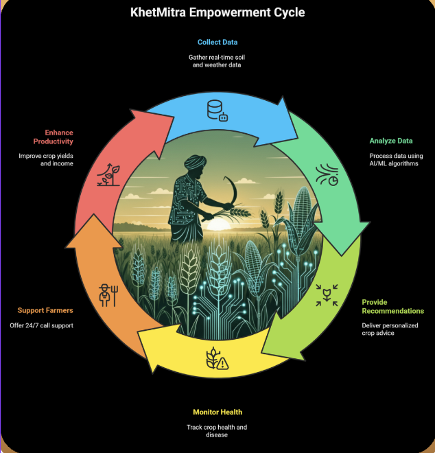
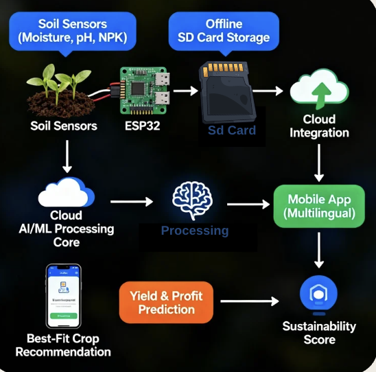
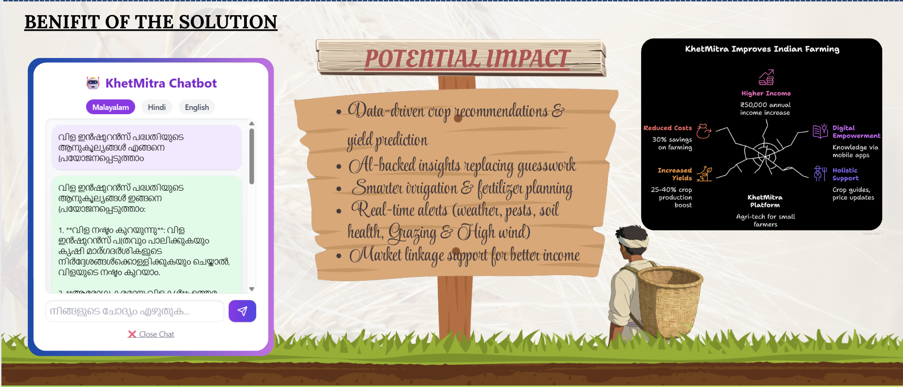
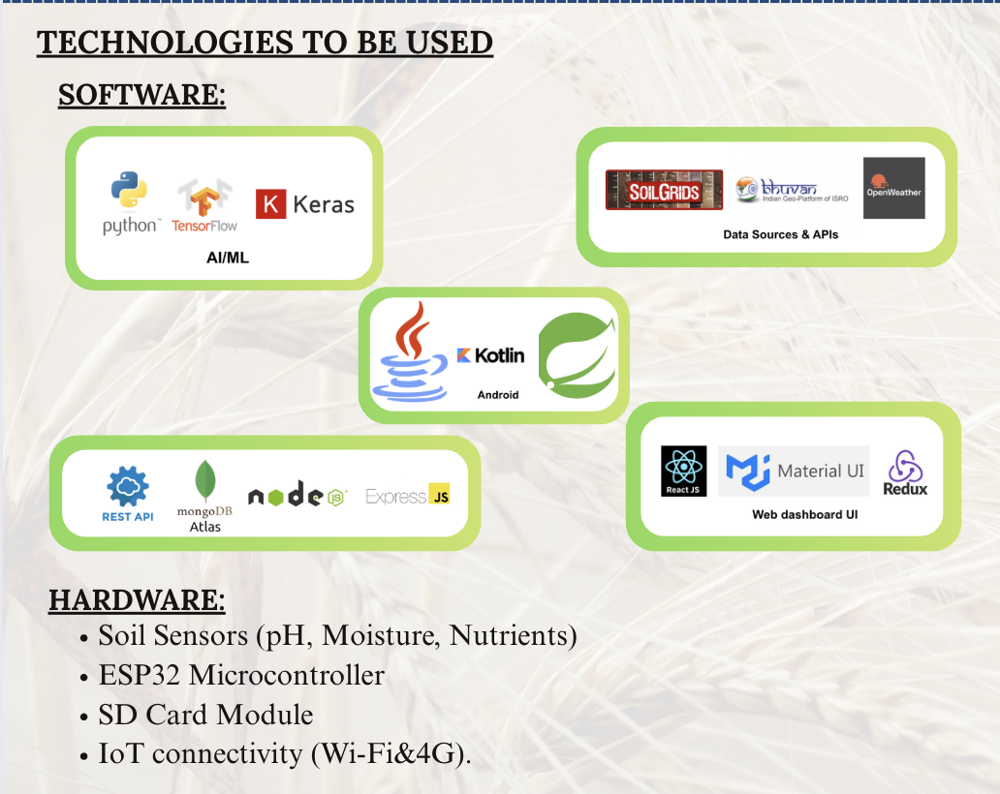

# 🌱 KhetMitra – Complete System Design & Architecture

## 1. Introduction
KhetMitra is an **AI-driven smart agriculture platform** that leverages **IoT sensors, cloud infrastructure, and AI models** to provide **crop recommendations, soil health analysis, irrigation planning, and sustainability insights** for farmers.

This document explains the **complete system architecture**, **data flow**, **entity relationships**, **technology stack**, and **scalability strategy** using the provided flow diagrams.

---

## 2. High-Level System Architecture

The overall system consists of four major layers:
1. IoT & Sensor Layer  
2. Backend & Cloud Layer  
3. AI & Decision Engine  
4. User Application Layer  

📌 **Architecture Diagram**  

---

## 3. IoT & Sensor Data Flow

### Components
- NPK Sensor
- Soil Moisture Sensor
- ESP32 Microcontroller
- Local SD Card Storage
- Wi-Fi / Mobile Hotspot

### Working
1. Sensors collect soil parameters (N, P, K, moisture).
2. ESP32 reads sensor data at fixed intervals.
3. Data is:
   - Stored locally on SD card (offline mode).
   - Sent to backend server when internet is available.
4. Failed transmissions are retried automatically.

📌 **IoT Data Flow Diagram**  

---

## 4. Backend & API Architecture

### Backend Responsibilities
- Accept sensor data via REST APIs
- Validate and normalize incoming data
- Store structured data in database
- Expose APIs for frontend & AI engine
- Handle authentication & rate limiting

### Tech Stack
- Node.js + Express.js
- MongoDB Atlas
- RESTful APIs
- JWT Authentication

📌 **Backend Flow Diagram**  

---

## 5. AI Decision & Recommendation Engine

### AI Responsibilities
- Crop recommendation based on soil NPK
- Yield prediction
- Fertilizer & irrigation advisory
- Sustainability scoring

### Working
1. Backend sends processed data to AI engine.
2. ML models analyze soil & historical data.
3. Gemini API is used for **context-aware reasoning** and **explainable recommendations**.
4. Results are sent back to backend APIs.

📌 **AI & Decision Flow Diagram**  

---

## 6. Entity Relationship (ER) Design

### Core Entities
- User
- Farm
- Sensor
- SoilReading
- CropRecommendation
- SustainabilityScore

### Relationships
- One User → Multiple Farms
- One Farm → Multiple Sensors
- Sensors → Generate SoilReadings
- SoilReadings → Produce CropRecommendations
- Recommendations → Generate Sustainability Scores

---

## 7. Application Layer

### Mobile Application
- Android (Kotlin)
- Multilingual support
- Simple farmer-friendly UI

### Web Dashboard
- React.js
- Real-time data visualization
- Admin & analytics view

### Features
- Live soil health monitoring
- Crop recommendation display
- Advisory notifications
- Sustainability insights

---

## 8. Scalability Strategy

### Backend Scaling
- Stateless APIs
- Horizontal scaling using load balancers
- Auto-scaling cloud instances

### Database Scaling
- MongoDB sharding
- Indexed queries
- Read replicas

### AI Scaling
- Asynchronous processing
- Batch predictions
- Model caching

---

## 9. Fault Tolerance & Reliability

- Offline SD card storage on IoT devices
- Automatic retry mechanism
- Graceful API failure handling
- Monitoring & logging
- Secure data transmission

---

## 10. Technology Stack Summary

| Layer | Technology |
|-----|-----------|
| IoT | ESP32, NPK Sensors |
| Backend | Node.js, Express |
| Database | MongoDB Atlas |
| AI | TensorFlow, Gemini API |
| Frontend | React.js, Kotlin |
| Cloud | AWS / Azure |

---

## 11. Conclusion

KhetMitra is designed as a **scalable, reliable, and intelligent agriculture platform** that integrates **real-time IoT data**, **AI-based decision making**, and **cloud-native architecture** to empower farmers with actionable insights.

The provided architecture ensures:
- High availability
- Fault tolerance
- Easy scalability
- Real-world deployment readiness
